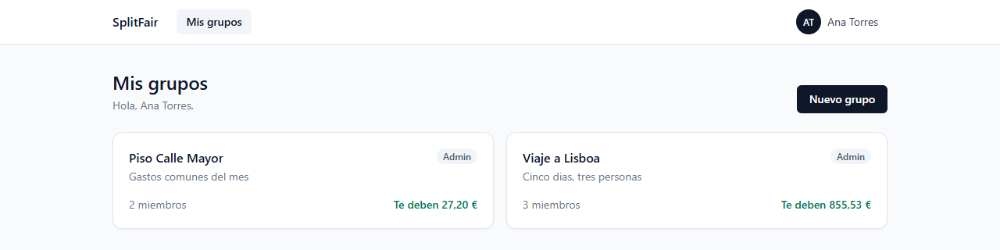
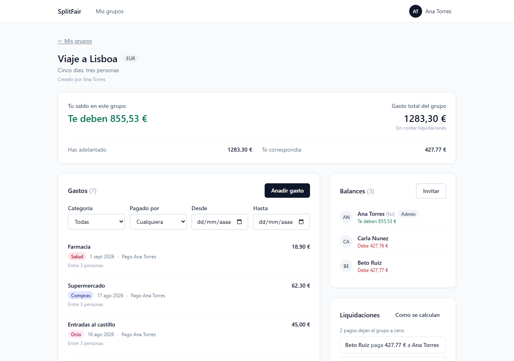
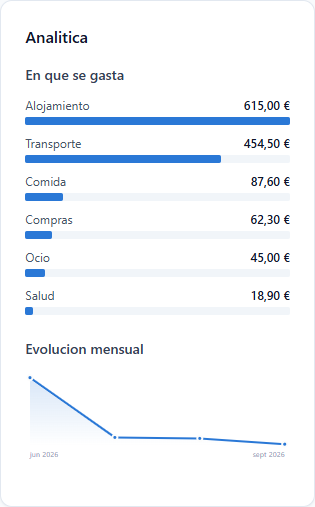

# SplitFair

App full stack para gestionar gastos compartidos entre grupos de personas (roommates, viajes, etc.), con cálculo automático de balances y simplificación de deudas.



Cada grupo lleva su propia moneda y su propio saldo. Dentro, los gastos con
su reparto, quién debe a quién, y el mínimo de pagos que dejan las cuentas a
cero:





La analítica se agrega **en SQL**, no en el cliente. El listado de gastos está
paginado, así que sumar lo que hay cargado daría totales parciales presentados
como completos; y sumar dinero en JavaScript es sumarlo en coma flotante.

Las barras usan un solo color a propósito: la longitud ya codifica la
magnitud, y un degradado por valor codificaría dos veces lo mismo.

<br clear="right">

## Stack

- **Backend:** Java 21, Spring Boot 3, Spring Data JPA, Spring Security + JWT, PostgreSQL, Maven, Lombok
- **Frontend:** React 18 + Vite 8, TypeScript, TailwindCSS, React Query, React Router 7
- **Infra:** Docker + Docker Compose

---

## Requisitos previos

Ya tienes Docker y VS Code. Necesitas instalar además:

### 1. JDK 21

**Windows:** descarga el instalador desde https://adoptium.net/ (elige Temurin 21 LTS) y sigue el wizard.

**Mac (con Homebrew):**
```bash
brew install openjdk@21
```

**Linux (Ubuntu/Debian):**
```bash
sudo apt update
sudo apt install openjdk-21-jdk
```

Verifica la instalación:
```bash
java -version
```
Deberías ver algo como `openjdk version "21..."`.

### 2. Maven

**Mac:**
```bash
brew install maven
```

**Linux:**
```bash
sudo apt install maven
```

**Windows:** descarga desde https://maven.apache.org/download.cgi y agrega la carpeta `bin` al PATH.

Verifica:
```bash
mvn -version
```

> Nota: el repo ya incluye el **Maven Wrapper**, asi que no necesitas instalar Maven globalmente.
> Desde `backend/` usa `./mvnw` (Linux/Mac) o `mvnw.cmd` (Windows) en lugar de `mvn`.

### 3. Node.js 22 LTS o superior, y npm

Vite 8 requiere Node `^20.19.0 || >=22.12.0`. Recomendado: Node 22 LTS.

Descarga desde https://nodejs.org/ (elige la versión LTS) o usa un gestor de versiones como `nvm`:
```bash
nvm install 22
nvm use 22
```

Verifica:
```bash
node -v
npm -v
```

### 4. Extensiones recomendadas de VS Code

Abre VS Code, ve a la pestaña de extensiones (Ctrl+Shift+X) e instala:
- **Extension Pack for Java** (Microsoft)
- **Spring Boot Extension Pack** (VMware/Microsoft)
- **ES7+ React/Redux/React-Native snippets**
- **Tailwind CSS IntelliSense**
- **Docker** (Microsoft)

---

## Cómo levantar el proyecto

### Paso 0 (obligatorio): el archivo `.env`

**Nada arranca sin esto.** `JWT_SECRET` no tiene valor por defecto y la
aplicación se niega a arrancar si falta o si mide menos de 32 bytes. Es
deliberado: un secreto con valor por defecto acaba en producción.

```bash
cp .env.example .env
```

Y rellena las dos variables sin valor:

| Variable | Cómo generarla |
|---|---|
| `DB_PASSWORD` | La que quieras; es tu Postgres local. |
| `JWT_SECRET` | `openssl rand -base64 48` |

⚠️ **`DB_PORT` viene en `5434`, no en 5432, y es a propósito.** Ver
[Conflicto de puerto en el 5432](#conflicto-de-puerto-en-el-5432). Solo afecta
al lado del host: dentro de Compose el backend habla con `postgres:5432`.

`.env` está en `.gitignore` y nunca debe versionarse.

### Opción A: Todo con Docker Compose

Desde la raíz del proyecto:
```bash
docker compose up --build
```

Levanta PostgreSQL, backend (`:8080`) y frontend (`:5173`).

```bash
docker compose down      # detener
docker compose down -v   # detener y BORRAR los datos
```

### Opción B: Por separado (lo normal mientras desarrollas)

Es la forma cómoda: recarga en caliente en ambos lados.

**1. Solo la base de datos:**
```bash
docker compose up postgres -d
```

**2. Backend** — en una terminal, desde `backend/`. Hay que **cargar el `.env`
antes**, o fallará por falta de `JWT_SECRET`:

```bash
# Git Bash
set -a && . /c/splitwise/.env && set +a
./mvnw spring-boot:run
```

```powershell
# PowerShell
Get-Content ..\.env | Where-Object { $_ -match '^[A-Z]' } | ForEach-Object {
  $n, $v = $_ -split '=', 2; Set-Item -Path "env:$n" -Value $v
}
.\mvnw spring-boot:run
```

Usa el **wrapper** (`./mvnw`), no `mvn`: fija la versión de Maven y la de la
API de Docker que necesitan los tests.

**3. Frontend** — en otra terminal, desde `frontend/`:
```bash
cp .env.example .env    # solo la primera vez
npm install
npm run dev
```

En `http://localhost:5173`.

> **Los dos tienen que estar levantados a la vez.** El frontend guarda el
> access token en memoria y recupera la sesión pidiéndole uno nuevo al
> backend; sin backend, todo acaba en la pantalla de acceso.

---

## Verificar que todo funciona

### Por la interfaz

1. Abre `http://localhost:5173`. Sin sesión te lleva a `/login`.
2. Crea una cuenta en **Crear una** → entras al dashboard.
3. **Recarga la página (F5).** Debes seguir dentro. Ese es el criterio de la
   Fase 5: el access token vive en memoria y se perdió, pero la cookie
   `HttpOnly` del refresh token sobrevive y la sesión se recupera sola.
4. Menú de usuario → **Cerrar sesión** → vuelves a `/login`.

### Por la API

Swagger en `http://localhost:8080/swagger-ui.html` (solo en el perfil `dev`;
en producción está apagado a propósito).

```bash
curl -i -X POST http://localhost:8080/api/auth/register \
  -H "Content-Type: application/json" \
  -d '{"name":"Ana Test","email":"ana@test.com","password":"password123"}'
```

Responde **201** con `{accessToken, expiresIn, userId, name, email}` y una
cabecera `Set-Cookie: refresh_token=...; HttpOnly`.

⚠️ **El refresh token no aparece en el cuerpo.** Va solo en esa cookie. Para
probar el refresco a mano hace falta un tarro de cookies:

```bash
curl -s -c /tmp/jar -X POST http://localhost:8080/api/auth/login \
  -H "Content-Type: application/json" \
  -d '{"email":"ana@test.com","password":"password123"}'

curl -i -b /tmp/jar -X POST http://localhost:8080/api/auth/refresh   # sin cuerpo
```

Para llamar al resto de la API, pega el `accessToken` en `Authorization`:

```bash
curl http://localhost:8080/api/groups -H "Authorization: Bearer <accessToken>"
```

---

## Base de datos y migraciones

El esquema lo gobierna **Flyway**, no Hibernate. Los scripts viven en
`backend/src/main/resources/db/migration/` y se aplican solos al arrancar.

`spring.jpa.hibernate.ddl-auto` está en `validate`: la aplicación se niega a
arrancar si las entidades y las tablas han divergido. Eso convierte un error
silencioso en un fallo inmediato y visible.

**Para cambiar el esquema** se añade una migración nueva (`V2__...sql`). Nunca
se edita una ya aplicada: Flyway guarda su hash y aborta si cambia.

### Conflicto de puerto en el 5432

Si tienes un PostgreSQL instalado de forma nativa (en Windows es habitual, como
servicio `postgresql-x64-NN`), ocupará el 5432 y tus conexiones irán a él en vez
de al contenedor, con un desconcertante `password authentication failed`.

Comprueba quién escucha:

```bash
netstat -ano | grep ":5432"          # Linux / Git Bash
Get-NetTCPConnection -LocalPort 5432 # PowerShell
```

Solución: en tu `.env`, usa otro puerto para el contenedor.

```env
DB_PORT=5434
```

Solo cambia el puerto del lado del host. Dentro de Docker Compose el backend
sigue hablando con `postgres:5432` por la red interna, así que no hay que tocar
nada más.

## Cómo se manejan los usuarios

No hay panel de administración ni usuarios semilla: **las cuentas se crean
desde la propia aplicación**, y hay dos caminos.

### 1. Registro abierto

`POST /api/auth/register`, o el formulario en `/register`. Email único
(normalizado a minúsculas: `Ana@x.com` y `ana@x.com` son la misma cuenta) y
contraseña de 8 caracteres como mínimo, guardada con BCrypt.

Quien se registra así **no pertenece a ningún grupo**: crea el suyo o espera
una invitación.

### 2. Registro con invitación

Un miembro genera un link (`POST /api/groups/{id}/invitations`) y quien lo
abre se registra y entra al grupo **en una sola petición**
(`/register` con `invitationToken`). En una sola por atomicidad: con dos
llamadas, un fallo entre ambas deja al usuario registrado y fuera del grupo.

Los links son de **un solo uso** y caducan a los **7 días**. Para invitar a
tres personas se generan tres links. Si se indica un email al crearlo, solo
esa dirección puede aceptarlo.

En el frontend, `/register?invitation=<token>` ya arrastra el token.

### Roles dentro de un grupo

Son **por grupo**, no globales: se puede ser administrador de uno y miembro
raso de otro.

| | Puede |
|---|---|
| **MEMBER** | Ver el grupo, registrar gastos, registrar y confirmar pagos suyos |
| **ADMIN** | Todo lo anterior, más editar el grupo, invitar, expulsar y cambiar roles |

Quien crea un grupo es su administrador. Dos reglas que la API impone y no se
pueden saltar:

- **Un grupo nunca se queda sin administrador.** Si pudiera, nadie podría
  invitar, expulsar ni editarlo: quedaría congelado sin vía de recuperación.
  El último miembro sí puede salir, porque ya no hay a quien dejar huérfano.
- **Nadie sale de un grupo con saldo distinto de cero.** Los balances se
  construyen a partir de la lista de miembros; si alguien con deuda deja de
  serlo, sus gastos siguen en la base pero desaparecen del informe y los
  balances de los que quedan dejan de sumar cero. El dinero se evaporaría.

### Gestión de la propia cuenta

- `GET /api/users/me` — perfil
- `PATCH /api/users/me` — cambiar el nombre (el email no se cambia por esta vía)
- `POST /api/users/me/password` — cambiar la contraseña, exigiendo la actual

Cambiar la contraseña **revoca todas las sesiones abiertas, incluida la
propia**. Quien la cambia suele hacerlo porque sospecha que alguien más tiene
acceso; si las sesiones sobrevivieran, el intruso conservaría un refresh token
válido durante treinta días.

### Dar de baja una cuenta

`DELETE /api/users/me`, con la contraseña actual en el cuerpo.

**No borra la fila, la anonimiza**, y esa es la decisión de fondo. Quien se da
de baja aparece en gastos, repartos y liquidaciones confirmadas: borrarlo
dejaría apuntes sin dueño y los balances del grupo dejarían de sumar cero, es
decir, dinero evaporándose del informe sin que nadie lo hubiera pagado.

Lo que se elimina son los datos personales. Nombre y correo se sustituyen —el
correo por uno aleatorio en el dominio reservado `.invalid`— y el hash de la
contraseña se reemplaza por uno que nadie conoce. Para el resto del grupo, esa
persona pasa a ser «Usuario eliminado» en un histórico que sigue cuadrando.

Efectos inmediatos: las sesiones se revocan, y los access token que siguieran
vivos dejan de valer al instante, porque llevan el correo como sujeto y ese
correo ya no existe. El correo original queda libre: quien quiera puede volver
a registrarse, y será una cuenta nueva sin relación con los apuntes anteriores.

Todavía **no hay pantalla** para hacerlo; solo la API.

---

## Cómo se reparte el dinero

Es el núcleo del proyecto y donde están las decisiones que más cuestan de ver.

### El reparto se hace en céntimos enteros

El enfoque evidente —`total.divide(n, 2, HALF_UP)`— **no cuadra**. Repartir
`100,00` entre 6 da `16,67` a cada uno, que suman `100,02`: no solo se pierde
dinero, se **inventa**.

`MoneySplitter` reparte por **mayor residuo** en aritmética entera de
céntimos: divide, reparte el resto de uno en uno, y la suma de las partes es
exactamente el total. Hay un test que lo comprueba de forma exhaustiva sobre
500.000 repartos.

Los participantes se ordenan por id antes de repartir, de modo que recalcular
un gasto no cambia a quién le toca el céntimo de más. Se ve en las capturas
de arriba: de `1283,30 €` entre tres, uno debe `427,76` y otro `427,77`.

Los cuatro modos de reparto —a partes iguales, importes exactos, porcentajes y
partes proporcionales— son estrategias separadas. Añadir uno es crear una
clase: si algún valor del enum se queda sin implementación, la aplicación
**no arranca**, en vez de fallar el día que alguien lo use.

### Los balances se calculan, no se acumulan

```
balance = (adelantado − adeudado) + (entregado − cobrado)
```

Solo cuentan las liquidaciones **confirmadas**. Una pendiente es la palabra de
una sola parte: si contara, bastaría declarar un pago inexistente para borrar
una deuda. Y solo puede confirmarla **quien cobra**.

El cálculo son dos consultas de agrupación en SQL, con coste independiente del
número de gastos, y parte de la lista de **miembros** y no de la de gastos,
para que quien no ha pagado nada aparezca con `0,00` en vez de desaparecer del
informe.

La invariante que lo sostiene: **los balances de un grupo suman siempre cero**.
De ahí salen dos reglas que parecen arbitrarias y no lo son: nadie sale de un
grupo con saldo distinto de cero, y dar de baja una cuenta la anonimiza en vez
de borrarla. En ambos casos, quitar a una persona del informe dejaría su deuda
sin contraparte y el dinero se evaporaría de las cuentas del resto.

### Saldar con el mínimo de pagos

Con tres personas hacen falta como mucho dos pagos, no seis. El algoritmo es
voraz: empareja repetidamente al que más debe con el que más tiene que cobrar,
y salda el menor de los dos importes. Con *n* personas, nunca más de *n − 1*
transferencias.

No siempre es el óptimo teórico —encontrarlo es NP-difícil—, pero está a un
paso de serlo y se calcula al instante. Sus propiedades se comprueban sobre
unas 1.550 configuraciones aleatorias con **semilla fija escrita en el
código**: un test aleatorio que falla y no se puede reproducir da una alarma
que nadie sabe investigar.

---

## Autenticación

Dos credenciales con responsabilidades distintas:

| | Vida | Naturaleza | Revocable |
|---|---|---|---|
| **Access token** | 15 min | JWT, sin estado | No |
| **Refresh token** | 30 días | Valor opaco, con estado en BD | Sí |

**Dónde vive cada uno en el cliente:** el access token, **en memoria** (se
pierde al recargar, y es lo esperado). El refresh token, en una cookie
`HttpOnly` acotada a `/api/auth` que ningún script puede leer.

Guardar el access token en memoria y el refresh en `localStorage` sería
seguridad de escaparate: lo que un XSS se lleva de ahí no es una credencial de
15 minutos, sino una de 30 días y renovable. Por eso `AuthResponse` **no
expone** `refreshToken`, y `/auth/refresh` y `/auth/logout` van **sin cuerpo**.

> Si escribes un cliente propio, Axios necesita `withCredentials: true` o
> `fetch` necesita `credentials: 'include'`. Sin eso la cookie no viaja entre
> orígenes distintos y todo refresco falla con 401, con el síntoma
> desconcertante de que la sesión se cae exactamente a los 15 minutos.

El access token no se puede revocar, y por eso vive poco: su validez es el
tiempo máximo que sobrevive una credencial robada. La capacidad de cortar una
sesión vive en el refresh token.

**Rotación.** Cada refresco invalida el token presentado y emite uno nuevo
dentro de la misma *familia*. Si alguna vez se presenta un token ya rotado,
significa que existe una copia en circulación: se revoca la familia entera.
No se puede distinguir a la víctima del atacante, así que se corta el acceso
a ambos, y la víctima detecta el problema al verse obligada a entrar de nuevo
(RFC 9700).

En la base solo se guarda el SHA-256 del token, nunca el token.

### Rate limiting

`/api/auth/login` y `/api/auth/register` están limitados **por IP y por email
a la vez**, porque cada dimensión cubre un ataque que la otra deja pasar: solo
por IP, una botnet prueba miles de contraseñas contra una cuenta; solo por
email, una sola máquina prueba una contraseña habitual contra miles de cuentas
(*password spraying*).

Configurable con `RATE_LIMIT_LOGIN_ATTEMPTS`, `RATE_LIMIT_LOGIN_WINDOW_MINUTES`
y sus equivalentes de registro.

> **Limitación conocida:** el estado vive en memoria, así que con varias
> instancias cada una aplica su propio límite y el efectivo se multiplica por
> el número de réplicas. Para escalar horizontalmente hay que mover los buckets
> a Redis (`bucket4j-redis`), sin cambiar el resto del diseño.

> **Detrás de un proxy inverso** hay que configurar
> `server.forward-headers-strategy=FRAMEWORK`. La IP se toma de
> `getRemoteAddr()` y no de `X-Forwarded-For` leída a mano: esa cabecera la
> envía el cliente y puede falsificarse, con lo que bastaría rotarla para
> saltarse el límite.

## Tests

```bash
cd backend
./mvnw clean test          # suite completa (386 tests)
./mvnw clean test -Dtest=NombreTest
```

⚠️ **Usa siempre `clean`.** La extensión de Java de VS Code compila dentro de
`target/` con su procesador Lombok roto y deja ahí `.class` marcados como
`Unresolved compilation problems`. Maven los da por buenos y `./mvnw test`
falla con errores de compilación inventados sobre código que está perfecto. Es
además lo que MapStruct necesita para regenerar los mappers.

Frontend, con **Vitest + Testing Library** sobre jsdom:

```bash
cd frontend
npm test            # suite completa (49 tests)
npm run test:watch  # en vigilancia, mientras desarrollas
npx tsc --noEmit    # tipos
npm run lint
npm run build
```

Los tests de frontend **no hablan con el backend**: eso se verifica en un
navegador real contra el servidor real. Aquí se cubre la lógica que un
recorrido por la interfaz no distingue —que una suma cuadre al céntimo, que un
gasto no quede fechado mañana, que la guarda de ruta no expulse a nadie
mientras comprueba la sesión— y que además sería lenta y frágil de comprobar a
mano.

Los tests de integración levantan un **PostgreSQL 16 real con Testcontainers**,
no H2. H2 acepta SQL que PostgreSQL rechaza y no implementa igual `NUMERIC` ni
las palabras reservadas: dejaría pasar migraciones que fallan en producción.

Requiere Docker en marcha. El `pom.xml` fija `docker.api.version` porque los
daemon recientes (Docker 25+, `MinAPIVersion` 1.44) rechazan con HTTP 400 la
versión de API que `docker-java` negocia por defecto, y Testcontainers reporta
entonces un engañoso *"Could not find a valid Docker environment"*. Si tu Docker
es más antiguo, ajústalo:

```bash
./mvnw test -Ddocker.api.version=1.43
```

### Integración continua

Todo lo anterior se ejecuta solo en cada push a `main` y en cada pull request
([`.github/workflows/ci.yml`](.github/workflows/ci.yml)): backend y frontend en
paralelo, más una auditoría de vulnerabilidades y la revisión de las
dependencias que añade cada rama.

Para que además **impida fusionar algo roto**, hay que marcar los checks como
obligatorios en GitHub — Settings → Branches → Add rule sobre `main`,
seleccionando *Backend* y *Frontend*. No viene activado en el repositorio: es
un ajuste de GitHub, no un fichero, y activarlo obliga a trabajar con pull
requests en vez de empujar directo a `main`.

---

## Estructura del proyecto

```
splitfair/
├── .github/workflows/ci.yml   Integración continua
├── backend/
│   ├── Dockerfile             Imagen de producción, en capas y sin root
│   └── src/main/
│       ├── java/com/expensesplit/
│       │   ├── config/        Spring Security, CORS, OpenAPI
│       │   ├── controller/    Endpoints REST
│       │   ├── service/       Lógica de negocio
│       │   │   └── split/     Una estrategia por modo de reparto
│       │   ├── repository/    Interfaces JPA
│       │   ├── model/         Entidades
│       │   ├── dto/           Objetos de transferencia
│       │   ├── security/      JWT, filtros, rate limiting, cookie
│       │   ├── observability/ Identificador por petición, tareas periódicas
│       │   └── exception/     Manejo global de errores
│       └── resources/db/migration/   Migraciones Flyway
├── frontend/
│   ├── Dockerfile             Compila y sirve con nginx
│   ├── nginx.conf             SPA + proxy de /api al mismo origen
│   └── src/
│       ├── api/               Cliente HTTP, tipos y renovación de sesión
│       ├── features/          Auth, grupos, gastos, balances, analítica
│       ├── components/        Componentes base
│       └── routes/            Rutas y guardas
├── scripts/                   backup.sh y restore.sh
├── docs/DESPLIEGUE.md         Guía de despliegue
├── docker-compose.yml         Desarrollo
└── docker-compose.prod.yml    Producción
```

## La API de un vistazo

Base: `/api`. El contrato completo, con cuerpos y validaciones, está en
OpenAPI: `http://localhost:8080/swagger-ui.html` (solo en desarrollo; en
producción está desactivado a propósito).

| Método y ruta | Qué hace |
|---|---|
| `POST /auth/register` · `/auth/login` | Devuelven el access token; el refresh va en cookie `HttpOnly` |
| `POST /auth/refresh` · `/auth/logout` | Sin cuerpo: leen la cookie |
| `GET · PATCH /users/me` | Perfil y cambio de nombre |
| `POST /users/me/password` | Cambiar contraseña; revoca todas las sesiones |
| `DELETE /users/me` | Baja de cuenta con anonimización |
| `GET · POST /groups` | Listado paginado y creación |
| `GET · PATCH /groups/{id}` | Detalle y edición (solo admin) |
| `POST · DELETE /groups/{id}/members/{userId}` | Añadir y expulsar |
| `PATCH /groups/{id}/members/{userId}/role` | Cambiar de rol |
| `POST /groups/{id}/invitations` | Link de invitación de un solo uso |
| `GET /invitations/{token}` | Vista previa **pública** |
| `POST /invitations/{token}/accept` | Aceptar |
| `GET · POST /groups/{id}/expenses` | Listado con filtros y paginación, y alta |
| `PUT · DELETE /expenses/{id}` | Editar y borrar (pagador o admin) |
| `GET /groups/{id}/analytics` | Gasto por categoría y por mes |
| `GET /groups/{id}/balances` | Balances con desglose |
| `GET · POST /groups/{id}/settlements` | Pagos sugeridos y registro de uno real |
| `POST /settlements/{id}/confirm` | Confirmar (solo quien cobra) |

Los códigos que el cliente debe distinguir:

| | Significado | Qué hacer |
|---|---|---|
| **401** | No sé quién eres | Renovar con el refresh token; si falla, ir al login |
| **403** | Sé quién eres, no puedes | **No renovar.** Mostrar el mensaje |
| **429** | Cupo agotado | Respetar la cabecera `Retry-After` |

Confundir 401 con 403 hace que el cliente reintente la renovación en bucle
contra un recurso al que no tiene derecho.

---

## Estado del proyecto

El plan por fases está en [PLAN.md](PLAN.md). **Fases 0-8 completadas.**
Para desplegarlo, la [guía de despliegue](docs/DESPLIEGUE.md).

### Backend: terminado

- ✅ Modelo de datos, migraciones Flyway (8) y **386 tests** con PostgreSQL real
- ✅ Autenticación de nivel producto: rotación de refresh tokens con detección
  de reutilización, cookie `HttpOnly`, rate limiting por IP y por email
- ✅ Grupos, roles, invitaciones por link de un solo uso
- ✅ Gastos con los cuatro modos de reparto (EQUAL, EXACT, PERCENTAGE, SHARES),
  categorías, filtros y paginación
- ✅ Balances con desglose y liquidaciones con confirmación
- ✅ **Simplificación de deudas** al mínimo de transacciones
- ✅ OpenAPI/Swagger
- ✅ Sondas de estado, métricas y logs en JSON con identificador por petición
- ✅ Baja de cuenta con anonimización, y purga programada de credenciales caducadas

### Frontend

- ✅ Capa de API tipada con renovación transparente del token
- ✅ Sesión, rutas protegidas y pantallas de acceso
- ✅ Layout, componentes base y estados vacíos
- ✅ Listado y detalle de grupos, con el saldo propio en cada uno
- ✅ Crear grupo, invitar por link y pantalla pública de aceptación
- ✅ Gastos con filtros, scroll infinito y los cuatro modos de reparto
- ✅ Balances con desglose, liquidaciones sugeridas y confirmación de pagos
- ✅ Analítica del gasto por categoría y por mes
- ✅ **49 tests** con Vitest + Testing Library

### Producción

- ✅ Integración continua en GitHub Actions: backend y frontend en paralelo,
  auditoría de dependencias y revisión de las que añade cada pull request
- ✅ Imágenes de producción: backend en capas sobre JRE y sin root, frontend
  compilado y servido por nginx (697 MB → 91 MB), con la API en el mismo origen
- ✅ Copias diarias con **restauración probada de extremo a extremo**
- ✅ Guía de despliegue

### Lo que falta

- ⬜ Editar y borrar gastos desde la interfaz. Los endpoints existen; falta un
  hueco del contrato: `Expense` trae `paidByName` pero no `paidByUserId`, así
  que no hay forma fiable de saber si el usuario actual pagó el gasto.
- ⬜ Cambiar de rol y expulsar miembros desde la interfaz.
- ⬜ Registrar un pago que no salga de una sugerencia.
- ⬜ Pantalla para darse de baja.

### Deuda conocida

- **Rate limiting en memoria.** Con varias réplicas el límite efectivo se
  multiplica. Escalarlo es mover los buckets a Redis.
- **Códigos de creación inconsistentes.** `POST /groups` y
  `POST /groups/{id}/expenses` devuelven 200; `/auth/register`,
  `/invitations` y `/settlements` devuelven 201. El cliente no ramifica sobre
  ello, así que unificarlo sigue siendo un cambio de una línea.
- `SecurityConfig` avisa al arrancar sobre el `AuthenticationManager` global;
  funciona, pero conviene limpiarlo.

